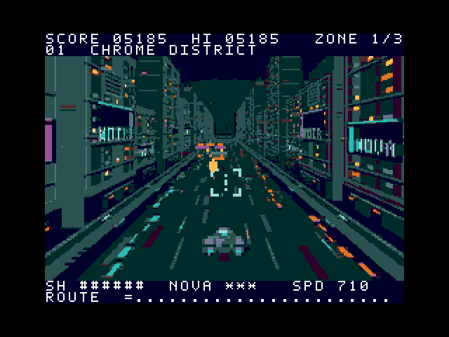
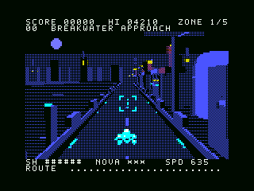
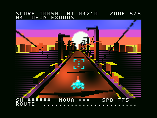
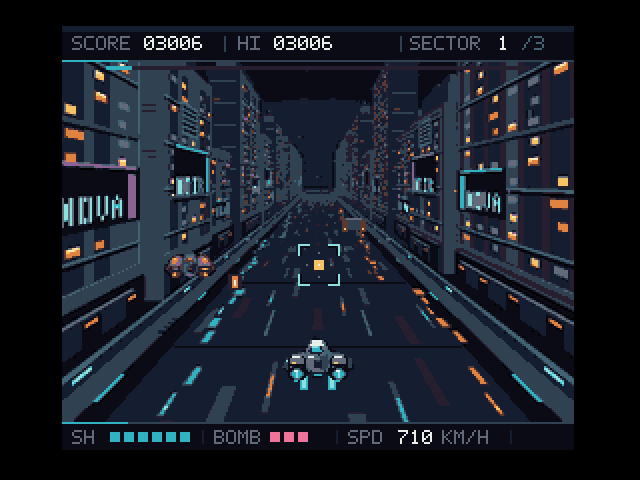
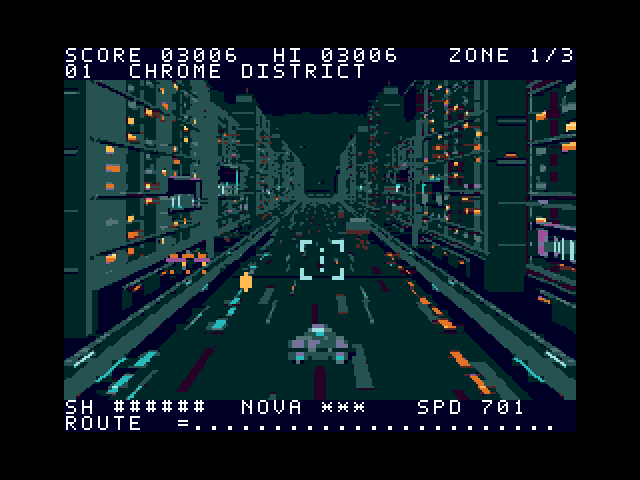

# NEON REVENANT

**開発途中の実験的なプロトタイプです。無保証で公開しており、MSX実機・実カートリッジでの動作確認はしていません。** 動作確認はopenMSX上で行っています。利用前に[免責事項](DISCLAIMER.md)と[著作権・ライセンスの状態](COPYRIGHT.md)を確認してください。

夜のサイバー都市を疾走する、MSX用512 KiB ASCII8 MegaROMの疑似3Dシューティングです。『ナイトストライカー』に着想を得て、区域ごとのボス戦、連射とNOVAボムを実装しています。V9990版・turbo R単体版・MSX2版は3区域、初代MSX版v1.2は5区域です。V9990版・turbo R単体版はMSX-MUSIC＋PSG、MSX2版・初代MSX版は標準PSGで音楽と効果音を鳴らします。本作はタイトーやMSX関連各社の公式作品ではありません。

「もしMSX3が存在したら」を出発点に、V9990から初代MSXまで、機種の制約に合わせた4種類のROMを公開しています。ゲームはMSX上のネイティブプログラムとして動きます。背景画像やパターンを開発時に生成し、実行時はMSXのVDPで表示・切り替え・合成します。

[試作版のダウンロード / Releases](https://github.com/kanon-ai/NEON_REVENANT/releases)

## ASTRAからの有難うエディション

初代MSX版v1.2を **ASTRAからの有難うエディション / ASTRA Thank-You Edition** として公開します。遊んでくださった方、動画を見てくださった方、コメントを寄せてくださった方、実機で試してくださった方へ。有難うございます。湾岸から都市へ入るEpisode 0と、夜明けへの脱出路を加えました。

Thank you to everyone who played, watched, commented, or tried the game on real hardware. Two new routes invite you back: enter through the harbor, then find your way into dawn.

[この版について・お礼 / About this edition and our thanks](docs/ASTRA_THANK_YOU_EDITION.md) · [MSX1 v1.2 ROM](outputs/msx1/v1.2/NEON_REVENANT-MSX1-v1.2.rom) · [日本語ガイド](msx1/README.md) · [English guide](msx1/README-en.md)

## ASTRAとMSXゲームを作るには

[制作ノウハウ：ASTRAとMSXゲームを作る — NEON REVENANT開発ノート](docs/ASTRA_MSX_GAMEDEV_JA.md)

機種とROM容量を指定する依頼から、背景の疾走感、素材の作り込み、turbo R・MSX2・初代MSXへの移植、openMSXでの検証までを紹介しています。再構成したプロンプト例と実装へのリンクを載せ、人間の方向づけとAIによる実装・修正をどう往復したかをまとめました。

[上位機種で完成像を作り、魅力を残しながら下位機種へ移す](docs/ASTRA_MSX_GAMEDEV_JA.md#top-down-porting)という制作方針を追記しました。移植で守るもの、工夫を試す順序、品質が保てなくなったときに対応機種を区切る判断を整理しています。[English development approach](docs/DEVELOPMENT_APPROACH_EN.md)も公開しています。

## MSX2版・初代MSXチャレンジ版

| 項目 | MSX2 Edition v1.0 | MSX1 PCG Drive v1.2 / ASTRA Thank-You Edition |
| --- | --- | --- |
| CPU・RAM | 標準Z80 3.58MHz、RAM64KiB | 標準Z80 3.58MHz、RAM32KiB（8000h～FFFFhを同一RAMスロットに配置） |
| VDP・VRAM | V9938、128KiB | TMS9918A系、16KiB |
| 表示 | SCREEN 4、256×192、512色から16色 | SCREEN 2、256×192、固定色 |
| 前進する背景 | turbo R単体版の8枚の背景を保持 | 湾岸→既存3区域→夜明けの5区域、各16位相のPCGを先読み |
| 自機・敵 | 絵柄をVRAMへキャッシュして転送を削減 | 絵柄を常駐させ、1枚1色・走査線4枚のスプライト制限へ縮約 |
| 音源 | 標準PSGのみ。FM拡張不要 | 標準PSGのみ。FM拡張不要 |
| ROM | [MSX2版ROM](outputs/msx2/NEON_REVENANT-MSX2-v1.0.rom) | [初代MSX版ROM](outputs/msx1/v1.2/NEON_REVENANT-MSX1-v1.2.rom)、512KiB中144KiB未使用 |
| 起動・操作・性能・制限 | [MSX2版ガイド](msx2/README.md) | [日本語](msx1/README.md) / [English](msx1/README-en.md) |

MSX2版は3区域・3ボス、初代MSX版v1.2は5区域・5回のボス戦です。両版ともキーボードとジョイスティック、ポーズ・再挑戦に対応します。初代MSX版の対象は**RAM32KiB・VRAM16KiBの構成**です。描画速度と表示制約、試験条件は各ガイドに記録しています。

初代MSX版v1.2は元3区域の背景・戦闘設定・曲を保ち、新しい2背景と2曲を追加しました。ボス画像は既存3種類を使い、導入と脱出で色替えしています。openMSXの32KiB構成で、移動・連射区間はNTSC約24～27fps、PAL約22～24fps、背景更新は約11～13Hzでした。ゲームと音楽はフレームに同期するためPALは遅くなります。旧v1.0／v1.1も以前のリリースに残しています。

### MSX2版の実行画面



### 初代MSX版の実行画面

Episode 0：BREAKWATER APPROACH



最終区域：DAWN EXODUS



## V9990版・turbo R単体版

| 項目 | V9990版 v1.2 | Turbo R単体版 v1.0 |
| --- | --- | --- |
| 必要なグラフィックス機器 | turbo R + V9990 / GFX9000 | turbo R内蔵V9958のみ |
| 表示 | B1、256×212、16色 | SCREEN 4、256×192、16色 |
| 色の選択範囲 | RGB5、32,768色 | RGB3、512色 |
| 区域ごとの前進背景 | 16フレーム、LZSS圧縮からVRAMへ展開 | 8フレーム、SCREEN 4ページをVRAMに保持 |
| 移動演出 | 前進背景と左右移動に追従するカメラの慣性 | 前進背景。背景の横揺れは省略 |
| openMSXでの更新速度 | 約30 fps（各区域29.96更新/秒） | 通常のゲーム・スプライト約30 fps、背景約15 fps |
| 負荷・表示上の制限 | 区域の展開中は数秒間、進行と音が停止 | 過密場面は約20 fps。スプライト集中時に部分欠落・ちらつき |
| ROM | [NEON_REVENANT-v1.2.rom](outputs/NEON_REVENANT-v1.2.rom) | [NEON_REVENANT-TurboR-v1.0.rom](outputs/turbor/NEON_REVENANT-TurboR-v1.0.rom) |
| 起動・ビルドの詳細 | [V9990版ガイド](outputs/README-ja.md) | [Turbo R単体版ガイド](turbor/README.md) |

いずれもROMは524,288バイトで、MSX-DOSは不要です。フレームレートはopenMSXのMSX側時間で測った更新速度であり、実機性能の保証ではありません。Turbo R単体版では、ボスを含む17枚のハードウェアスプライト使用時に29.96更新/秒、32枚を使う過密試験で19.97更新/秒でした。背景の横8×縦1ピクセルごとの最大2色、全画面32枚・走査線ごと最大8枚のスプライト制約があります。

### V9990版の実行画面



### Turbo R単体版の実行画面



上のGIFはROMを実行したopenMSXの画面を撮影したものです。コンセプト画像やPC用の再現映像ではありません。

## openMSXで起動する

V9990版・turbo R単体版の確認済み機種設定は**Panasonic_FS-A1ST**、エミュレーターは**openMSX 21.0**です。MSX2版と初代MSX版の設定はそれぞれのガイドを参照してください。必要なBIOS・システムROMは利用者が用意してください。このリポジトリには同梱していません。

| 設定 | V9990版 | Turbo R単体版 |
| --- | --- | --- |
| Machine | `Panasonic_FS-A1ST` | `Panasonic_FS-A1ST` |
| Cart 1 | V9990 / GFX9000拡張（`gfx9000`） | `NEON_REVENANT-TurboR-v1.0.rom`、ASCII8 |
| Cart 2 | `NEON_REVENANT-v1.2.rom`、ASCII8 | 空 |
| V9990拡張 | 必要 | 追加しない |
| 映像ソース | `GFX9000` | `MSX` |

F10でコンソールを開き、使用する版に対応したコマンドを入力します。

```tcl
# V9990版
set videosource GFX9000
```

```tcl
# Turbo R単体版
set videosource MSX
```

F10でコンソールを閉じ、背景の準備が終わったらSpaceまたはトリガー1で開始します。Windows用の起動方法とツールの配置は、各版のガイドを参照してください。

## 操作

| 操作 | キーボード | ジョイスティックポート1 |
| --- | --- | --- |
| 自機・照準の移動 | カーソルキー | 十字方向 |
| ショット・開始・再挑戦 | Space | トリガー1 |
| NOVAボム | X | トリガー2 |
| ポーズ・再開 | Esc | キーボードのEsc |

ショットは押し続けると連射します。ボムは1回押すごとに1発使用します。敵を照準に捉えて撃ち、敵弾と接近する敵機を避けて、各区域のボスを突破してください。

## ビルドと検証

ビルドにはPython、Pillow、NumPy、Z80用SDCC、Pasmoを使います。PC側の素材生成ツールはゲーム実行時には不要です。手順と環境変数は[V9990版のビルド説明](outputs/README-ja.md#ソースからビルド)と[Turbo R単体版のビルド説明](turbor/README.md#ソースからビルドする)にあります。ツールや第三者由来のコードの条件は[第三者ソフトウェアの表示](THIRD_PARTY_NOTICES.md)を参照してください。

openMSX上で起動、操作、射撃、ボム、ポーズ、被弾、再挑戦、各版の全区域のボスと区域遷移、最終クリアを確認し、背景やスプライトのVRAM読み戻しも照合しています。後半区域や過密場面などはRAMに開始状態を設定した試験で、最初から最後までの手動プレイスルーではありません。

- V9990版：[動作検証](outputs/verification-v1.2.json)、[背景・速度の検証](outputs/world-verification-v1.2.json)
- Turbo R単体版：[動作検証](outputs/turbor/verification.json)、[背景検証](outputs/turbor/world-verification.json)、[スプライト・速度の検証](outputs/turbor/sprite-verification.json)
- MSX2版：[動作検証](outputs/msx2/verification.json)、[背景検証](outputs/msx2/world-verification.json)、[スプライト・速度の検証](outputs/msx2/sprite-verification.json)
- 初代MSX版v1.2：[NTSC動作](outputs/msx1/v1.2/ntsc/verification.json)・[描画と速度](outputs/msx1/v1.2/ntsc/world-verification.json)、[PAL動作](outputs/msx1/v1.2/pal/verification.json)・[描画と速度](outputs/msx1/v1.2/pal/world-verification.json)、[検証環境と全265項目の内訳](outputs/msx1/v1.2/validation-environment.json)

MSX1 v1.2は32KiBのNTSC／PAL各127項目と64KiB構成の基本動作11項目が成功しました。両映像方式で計960描画フレームを照合し、既存3区域の戦闘も同じ入力・乱数から28,066状態が旧版と一致しました。詳しい範囲は[MSX1ガイド](msx1/README.md#検証の再実行)を参照してください。

**実機、各種ROMローダー、フラッシュカートリッジへの書き込み後の動作は未検証です。** エミュレーターでの確認は、それらの互換性や安全性を保証しません。

## 配布パッケージの再作成

4版をビルドした後、リポジトリ直下で `python tools/package.py` を実行すると、全ROM・ソース・素材・開発ノート・検証結果・免責事項・第三者ライセンスをまとめた `outputs/NEON_REVENANT-public-prototype.zip` とSHA-256一覧を生成します。コンパイラー、エミュレーター、BIOSは同梱しません。

## 公開条件

公開者は **kanon-ai** です。本プロジェクト固有部分のライセンスは現時点で **UNSPECIFIED（未設定）** です。ソースを公開していますが、オープンソースライセンスに基づく公開ではありません。第三者のライセンス、GitHub上での扱いを含め、[COPYRIGHT.md](COPYRIGHT.md)と[DISCLAIMER.md](DISCLAIMER.md)を確認してください。

## English summary

[Development approach: start on the strongest target, then adapt downward](docs/DEVELOPMENT_APPROACH_EN.md) — lessons from building four MSX editions with ASTRA, and the creator's approach for future projects: keep a playable reference, decide what to preserve, and choose when to stop extending hardware support.

NEON REVENANT is an experimental, native MSX pseudo-3D rail shooter. Four 512 KiB ASCII8 ROM editions are available: V9990/GFX9000 v1.2, Turbo R v1.0 using V9958, MSX2 v1.0 using V9938, and MSX1 PCG Drive v1.2 using the TMS9918A family. The first three editions have three zones; **MSX1 v1.2 / ASTRA Thank-You Edition** adds an opening harbor route and a dawn escape for five zones and five boss encounters, using the existing three boss silhouettes. Its original three zones and melodies are preserved, with two new backgrounds and tunes.

MSX2 and MSX1 use standard PSG music and effects without an FM expansion. MSX2 targets 64 KiB RAM and 128 KiB VRAM. MSX1 v1.2 needs 32 KiB RAM at 8000h–FFFFh in one RAM slot and 16 KiB VRAM, with 144 KiB left unused in its 512 KiB ROM. Its 265 native checks passed, including full scenario suites on both 32 KiB NTSC/PAL configurations and a basic 64 KiB check. PAL gameplay and music run more slowly because they are frame-bound. See the [English MSX1 guide](msx1/README-en.md) and [thank-you edition notes](docs/ASTRA_THANK_YOU_EDITION.md) for measurements and test boundaries.

The V9990 edition measured about 30 updates/s in openMSX. The Turbo R edition normally updates gameplay and sprites at about 30/s and backgrounds at about 15/s; a crowded test dropped to about 20/s. Sprite overlap can cause missing parts and flicker. **Physical hardware has not been tested. This prototype is provided AS IS, without warranty. Its project-specific license is currently unspecified; public source availability is not an open-source license grant.** See [DISCLAIMER.md](DISCLAIMER.md), [COPYRIGHT.md](COPYRIGHT.md), and [THIRD_PARTY_NOTICES.md](THIRD_PARTY_NOTICES.md).
