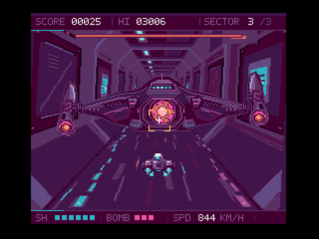
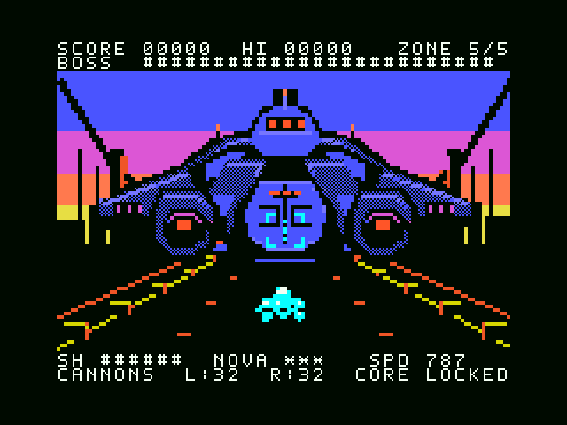
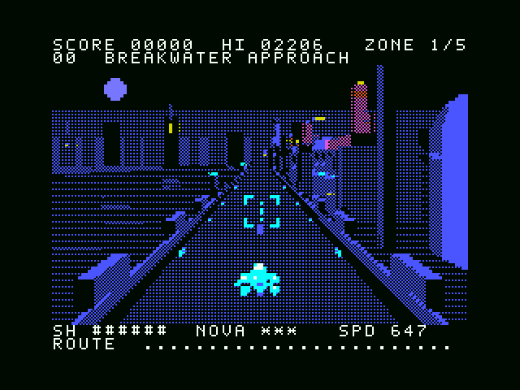
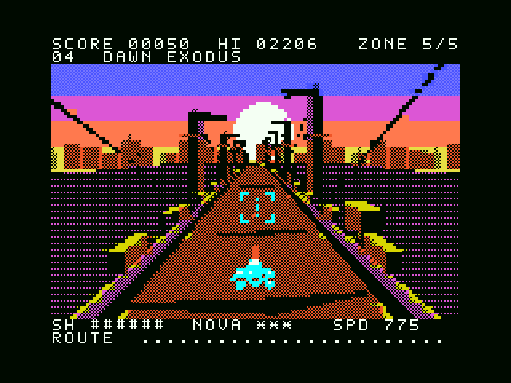

# NEON REVENANT

**開発途中の実験的なプロトタイプを無保証で公開しています。開発側の検証はopenMSX上で行い、新しい初代MSX版v1.3の実機・実カートリッジ動作は未確認です。** 旧版にはコミュニティから実機動作の報告が寄せられています。利用前に[免責事項](DISCLAIMER.md)と[著作権・ライセンスの状態](COPYRIGHT.md)を確認してください。

夜のサイバー都市を疾走する、MSX用512 KiB ASCII8 MegaROMの疑似3Dシューティングです。『ナイトストライカー』に着想を得て、区域ごとのボス戦、連射とNOVAボムを実装しています。V9990版・turbo R単体版・MSX2版は3区域、初代MSX版v1.3は巨大最終ボスを含む5区域です。V9990版・turbo R単体版はMSX-MUSIC＋PSG、MSX2版・初代MSX版は標準PSGで音楽と効果音を鳴らします。本作はタイトーやMSX関連各社の公式作品ではありません。

「もしMSX3が存在したら」を出発点に、V9990から初代MSXまで、機種の制約に合わせた4種類のROMを公開しています。ゲームはMSX上のネイティブプログラムとして動きます。背景画像やパターンを開発時に生成し、実行時はMSXのVDPで表示・切り替え・合成します。

[試作版のダウンロード / Releases](https://github.com/kanon-ai/NEON_REVENANT/releases)

## V9990 Feature Lab v0.1 — V9990専用機能試験版

**Turbo R高速モード＋V9990に向けた、独立した512 KiB ASCII8試験版を追加しました。** 下位機種への移植を前提にせず、幅216ドットの可動砲台・回転コア付き巨大ボス、2面の発光ゲート、背景の帯ごとの変形、環境色の変化、2枚のハードウェアカーソルによる照準を試しています。既存4版のROMは変更していません。

画像を可逆圧縮し、既存の全3面・各16背景位相を保ったまま、追加素材を含めてもROMの空きは**136,079 bytes（約133 KiB）**です。openMSXで63項目を検証し、巨大ボスは約30更新/秒、ゲート区間は約29更新/秒を確認しました。**本試験版は実機未確認・無保証です。** タイトルで **上＋Fire** を押すと巨大ボス戦へ、**Tab** で演出を切り替えられます。

[ROMをダウンロード](https://github.com/kanon-ai/NEON_REVENANT/raw/refs/heads/main/v9990-feature-lab/outputs/NEON_REVENANT-V9990-FeatureLab-v0.1.rom) · [ソース・動画入りZIP](https://github.com/kanon-ai/NEON_REVENANT/raw/refs/heads/main/v9990-feature-lab/outputs/NEON_REVENANT-V9990-FeatureLab-v0.1-complete.zip) · [日英ガイド / Guide](v9990-feature-lab/README.md) · [検証記録 / Validation](v9990-feature-lab/VALIDATION.md)



**V9990 Feature Lab v0.1** is a separate 512 KiB ASCII8 prototype for Turbo R in R800 mode with V9990. It adds a moving giant boss, projected energy gates, band-based background motion, palette effects and native cursor targeting. Lossless packing preserves all three existing stages and their 16 world phases, leaving 136,079 bytes free. All 63 openMSX checks passed; physical hardware has not been tested. Provided AS IS, without warranty. Use **Up + Fire** at the title for the giant boss, or **Tab** to toggle effects. The four existing editions remain unchanged.

## V9968 / V9990：次の表現に向けた調査

**Turbo R高速モード＋V9968への対応と、V9990版でのさらなる映像表現を検討しています。** V9968への対応については、設計者の方からご了承をいただいています。各VDPの特徴を生かして、画面の動きと奥行きをどこまで豊かにできるか、準備調査を進めています。

V9990については、上記の専用試験版を公開しました。V9968の具体的な演出・採用機能・公開時期は引き続き検討中です。[調査状況と可能性 — 日本語 / English](docs/VDP_RESEARCH_STATUS.md)

We are researching **Turbo R in R800 mode with V9968**, alongside further visual possibilities for the **V9990 edition**. The V9968 designer has given permission to pursue support. The separate V9990 Feature Lab is now available above; V9968 features and release timing remain under consideration. [English research update](docs/VDP_RESEARCH_STATUS.md#english).

## 初代MSX v1.3 — Dawn Leviathan

夜明けへの脱出路に、約216×98ドットの巨大PCG戦艦が出現します。船体の左右・上下移動、砲身の反動、コアの明滅を組み合わせました。左右の砲台を壊し、中央装甲が開いてからコアを攻撃します。最初の4区域と最終区域の通常道中はv1.2を維持しています。

**512KiB ASCII8 ROM・RAM32KiB・VRAM16KiBを維持し、ROMには88KiBの余裕があります。** openMSXのNTSC/PALで各200項目、計400項目のネイティブ検証に合格しました。

初代MSX版の開発はいったんv1.3で完了とします。バグ報告への対応可否・時期は未定で、修正やサポートは保証しません。試作版としての配布条件と無保証の扱いは継続します。 / Current feature development of the MSX1 edition is complete with v1.3. Whether or when bug reports will be addressed is undecided; fixes and support are not guaranteed. Prototype distribution terms and the no-warranty conditions remain in effect.

[v1.3リリース / Release](https://github.com/kanon-ai/NEON_REVENANT/releases/tag/prototype-msx1-dawn-leviathan-2026-09-07) · [MSX1 v1.3 ROM](outputs/msx1/v1.3/NEON_REVENANT-MSX1-v1.3.rom) · [巨大ボスの設計と検証 / Design and validation](docs/MSX1_DAWN_LEVIATHAN.md) · [日英プレイ・ビルドガイド](msx1/GIANT_BOSS-v1.3.md)



ROM実行から撮影した連続32描画フレームです。巨大ボス戦の実測更新速度はNTSC約29.96回/秒、PAL約25.07回/秒。PCG背景の位相はゲーム更新2回で1回進みます。

The original MSX now faces a giant PCG battleship at the end of DAWN EXODUS. Break both cannon pods, wait for the central armour to open, then attack the reactor. The new encounter keeps the 512 KiB ROM, 32 KiB RAM and 16 KiB VRAM targets. [English design and validation notes](docs/MSX1_DAWN_LEVIATHAN.md#english).

## 以前の版：ASTRAからの有難うエディション v1.2

初代MSX版v1.2は **ASTRAからの有難うエディション / ASTRA Thank-You Edition** として公開しました。遊んでくださった方、動画を見てくださった方、コメントを寄せてくださった方、実機で試してくださった方へ。有難うございます。湾岸から都市へ入るEpisode 0と、夜明けへの脱出路を加えた版です。

Thank you to everyone who played, watched, commented, or tried the game on real hardware. Two new routes invite you back: enter through the harbor, then find your way into dawn.

[この版について・お礼 / About this edition and our thanks](docs/ASTRA_THANK_YOU_EDITION.md) · [MSX1 v1.2 ROM](outputs/msx1/v1.2/NEON_REVENANT-MSX1-v1.2.rom) · [日本語ガイド](msx1/README.md) · [English guide](msx1/README-en.md)

## ASTRAとMSXゲームを作るには

[制作ノウハウ：ASTRAとMSXゲームを作る — NEON REVENANT開発ノート](docs/ASTRA_MSX_GAMEDEV_JA.md)

機種とROM容量を指定する依頼から、背景の疾走感、素材の作り込み、turbo R・MSX2・初代MSXへの移植、openMSXでの検証までを紹介しています。再構成したプロンプト例と実装へのリンクを載せ、人間の方向づけとAIによる実装・修正をどう往復したかをまとめました。

[上位機種で完成像を作り、魅力を残しながら下位機種へ移す](docs/ASTRA_MSX_GAMEDEV_JA.md#top-down-porting)という制作方針を追記しました。移植で守るもの、工夫を試す順序、品質が保てなくなったときに対応機種を区切る判断を整理しています。[English development approach](docs/DEVELOPMENT_APPROACH_EN.md)も公開しています。

## MSX2版・初代MSXチャレンジ版

| 項目 | MSX2 Edition v1.0 | MSX1 PCG Drive v1.3 / Dawn Leviathan |
| --- | --- | --- |
| CPU・RAM | 標準Z80 3.58MHz、RAM64KiB | 標準Z80 3.58MHz、RAM32KiB（8000h～FFFFhを同一RAMスロットに配置） |
| VDP・VRAM | V9938、128KiB | TMS9918A系、16KiB |
| 表示 | SCREEN 4、256×192、512色から16色 | SCREEN 2、256×192、固定色 |
| 前進する背景 | turbo R単体版の8枚の背景を保持 | 湾岸→既存3区域→夜明けの5区域、各16位相のPCGを先読み |
| 自機・敵 | 絵柄をVRAMへキャッシュして転送を削減 | 自機・弾はスプライト、巨大最終ボスはPCG背景＋常駐する損傷パーツ |
| 音源 | 標準PSGのみ。FM拡張不要 | 標準PSGのみ。FM拡張不要 |
| ROM | [MSX2版ROM](outputs/msx2/NEON_REVENANT-MSX2-v1.0.rom) | [初代MSX版ROM](outputs/msx1/v1.3/NEON_REVENANT-MSX1-v1.3.rom)、512KiB中88KiB未使用 |
| 起動・操作・性能・制限 | [MSX2版ガイド](msx2/README.md) | [日本語 / English](msx1/GIANT_BOSS-v1.3.md) |

MSX2版は3区域・3ボス、初代MSX版v1.3は5区域・5回のボス戦です。両版ともキーボードとジョイスティック、ポーズ・再挑戦に対応します。初代MSX版の対象は**RAM32KiB・VRAM16KiBの構成**です。描画速度と表示制約、試験条件は各ガイドに記録しています。

初代MSX版v1.2で加えた湾岸・夜明けの背景と曲を維持し、v1.3では最終戦を巨大戦艦に置き換えました。通常道中は従来の16位相PCG背景を使い、ボス戦専用の配置に切り替えて大きな船体を表示します。ゲームと音楽はフレームに同期するためPALは遅くなります。旧v1.0／v1.1／v1.2も以前のリリースに残しています。

### MSX2版の実行画面


### 初代MSX版の実行画面

Episode 0：BREAKWATER APPROACH



最終区域：DAWN EXODUS



## V9990版・turbo R単体版

| 項目 | V9990版 v1.2 | Turbo R単体版 v1.0 |
| --- | --- | --- |
| 必要なグラフィックス機器 | turbo R + V9990 / GFX9000 | turbo R内蔵V9958のみ |
| 表示 | B1、256×212、16色 | SCREEN 4、256×192、16色 |
| 色の選択範囲 | RGB5、32,768色 | RGB3、512色 |
| 区域ごとの前進背景 | 16フレーム、LZSS圧縮からVRAMへ展開 | 8フレーム、SCREEN 4ページをVRAMに保持 |
| 移動演出 | 前進背景と左右移動に追従するカメラの慣性 | 前進背景。背景の横揺れは省略 |
| openMSXでの更新速度 | 約30 fps（各区域29.96更新/秒） | 通常のゲーム・スプライト約30 fps、背景約15 fps |
| 負荷・表示上の制限 | 区域の展開中は数秒間、進行と音が停止 | 過密場面は約20 fps。スプライト集中時に部分欠落・ちらつき |
| ROM | [NEON_REVENANT-v1.2.rom](outputs/NEON_REVENANT-v1.2.rom) | [NEON_REVENANT-TurboR-v1.0.rom](outputs/turbor/NEON_REVENANT-TurboR-v1.0.rom) |
| 起動・ビルドの詳細 | [V9990版ガイド](outputs/README-ja.md) | [Turbo R単体版ガイド](turbor/README.md) |

いずれもROMは524,288バイトで、MSX-DOSは不要です。フレームレートはopenMSXのMSX側時間で測った更新速度であり、実機性能の保証ではありません。Turbo R単体版では、ボスを含む17枚のハードウェアスプライト使用時に29.96更新/秒、32枚を使う過密試験で19.97更新/秒でした。背景の横8×縦1ピクセルごとの最大2色、全画面32枚・走査線ごと最大8枚のスプライト制約があります。

### V9990版の実行画面


### Turbo R単体版の実行画面


上のGIFはROMを実行したopenMSXの画面を撮影したものです。コンセプト画像やPC用の再現映像ではありません。

## openMSXで起動する

V9990版・turbo R単体版の確認済み機種設定は**Panasonic_FS-A1ST**、エミュレーターは**openMSX 21.0**です。MSX2版と初代MSX版の設定はそれぞれのガイドを参照してください。必要なBIOS・システムROMは利用者が用意してください。このリポジトリには同梱していません。

| 設定 | V9990版 | Turbo R単体版 |
| --- | --- | --- |
| Machine | `Panasonic_FS-A1ST` | `Panasonic_FS-A1ST` |
| Cart 1 | V9990 / GFX9000拡張（`gfx9000`） | `NEON_REVENANT-TurboR-v1.0.rom`、ASCII8 |
| Cart 2 | `NEON_REVENANT-v1.2.rom`、ASCII8 | 空 |
| V9990拡張 | 必要 | 追加しない |
| 映像ソース | `GFX9000` | `MSX` |

F10でコンソールを開き、使用する版に対応したコマンドを入力します。

```tcl
# V9990版
set videosource GFX9000
```

```tcl
# Turbo R単体版
set videosource MSX
```

F10でコンソールを閉じ、背景の準備が終わったらSpaceまたはトリガー1で開始します。Windows用の起動方法とツールの配置は、各版のガイドを参照してください。

## 操作

| 操作 | キーボード | ジョイスティックポート1 |
| --- | --- | --- |
| 自機・照準の移動 | カーソルキー | 十字方向 |
| ショット・開始・再挑戦 | Space | トリガー1 |
| NOVAボム | X | トリガー2 |
| ポーズ・再開 | Esc | キーボードのEsc |

ショットは押し続けると連射します。ボムは1回押すごとに1発使用します。敵を照準に捉えて撃ち、敵弾と接近する敵機を避けて、各区域のボスを突破してください。

## ビルドと検証

ビルドにはPython、Pillow、NumPy、Z80用SDCC、Pasmoを使います。PC側の素材生成ツールはゲーム実行時には不要です。手順と環境変数は[V9990版のビルド説明](outputs/README-ja.md#ソースからビルド)と[Turbo R単体版のビルド説明](turbor/README.md#ソースからビルドする)にあります。ツールや第三者由来のコードの条件は[第三者ソフトウェアの表示](THIRD_PARTY_NOTICES.md)を参照してください。

openMSX上で起動、操作、射撃、ボム、ポーズ、被弾、再挑戦、各版の全区域のボスと区域遷移、最終クリアを確認し、背景やスプライトのVRAM読み戻しも照合しています。後半区域や過密場面などはRAMに開始状態を設定した試験で、最初から最後までの手動プレイスルーではありません。

- V9990版：[動作検証](outputs/verification-v1.2.json)、[背景・速度の検証](outputs/world-verification-v1.2.json)
- Turbo R単体版：[動作検証](outputs/turbor/verification.json)、[背景検証](outputs/turbor/world-verification.json)、[スプライト・速度の検証](outputs/turbor/sprite-verification.json)
- MSX2版：[動作検証](outputs/msx2/verification.json)、[背景検証](outputs/msx2/world-verification.json)、[スプライト・速度の検証](outputs/msx2/sprite-verification.json)
- 初代MSX版v1.3：[NTSC動作](outputs/msx1/v1.3/ntsc/verification.json)・[巨大ボス](outputs/msx1/v1.3/ntsc/giant-verification.json)、[PAL動作](outputs/msx1/v1.3/pal/verification.json)・[巨大ボス](outputs/msx1/v1.3/pal/giant-verification.json)、[全400項目と再現性の説明](docs/MSX1_DAWN_LEVIATHAN.md#検証)

MSX1 v1.3は32KiBのNTSC／PAL各200項目が成功しました。各映像方式で通常背景480回・巨大ボス128回のVRAM読み戻しを照合しています。巨大ボス以外の既存C処理は、同じ入力・乱数から73,159時点×163項目がv1.2と一致しました。PCG状態遷移とZIP展開後のROM再ビルドも検証しています。[対象と限界の詳細](docs/MSX1_DAWN_LEVIATHAN.md#検証)を参照してください。

**新しいMSX1 v1.3の実機、各種ROMローダー、フラッシュカートリッジへの書き込み後の動作は未検証です。** 旧版へのコミュニティの実機報告や今回のエミュレーター検証は、新版・すべての構成での互換性を保証するものではありません。

## 配布パッケージの再作成

4版をビルドした後、リポジトリ直下で `python tools/package.py` を実行すると、全ROM・ソース・素材・開発ノート・検証結果・免責事項・第三者ライセンスをまとめた `outputs/NEON_REVENANT-public-prototype.zip` とSHA-256一覧を生成します。コンパイラー、エミュレーター、BIOSは同梱しません。

## 公開条件

公開者は **kanon-ai** です。本プロジェクト固有部分のライセンスは現時点で **UNSPECIFIED（未設定）** です。ソースを公開していますが、オープンソースライセンスに基づく公開ではありません。第三者のライセンス、GitHub上での扱いを含め、[COPYRIGHT.md](COPYRIGHT.md)と[DISCLAIMER.md](DISCLAIMER.md)を確認してください。

## English summary

[Development approach: start on the strongest target, then adapt downward](docs/DEVELOPMENT_APPROACH_EN.md) — lessons from building four MSX editions with ASTRA, and the creator's approach for future projects: keep a playable reference, decide what to preserve, and choose when to stop extending hardware support.

NEON REVENANT is an experimental, native MSX pseudo-3D rail shooter. Four 512 KiB ASCII8 ROM editions are available: V9990/GFX9000 v1.2, Turbo R v1.0 using V9958, MSX2 v1.0 using V9938, and MSX1 PCG Drive v1.3 using the TMS9918A family. The first three editions have three zones. **MSX1 v1.3 / Dawn Leviathan** retains the five-zone campaign introduced in v1.2 / ASTRA Thank-You Edition and replaces its final boss with a giant PCG battleship. The hull moves, individual cannon barrels recoil, and destroying both pods exposes a pulsing reactor after the armour opens. The first four zones and the ordinary final-zone route retain their prior behavior. Version 1.2 remains available as an earlier release.

MSX2 and MSX1 use standard PSG music and effects without an FM expansion. MSX2 targets 64 KiB RAM and 128 KiB VRAM. MSX1 v1.3 needs 32 KiB RAM at 8000h–FFFFh in one RAM slot and 16 KiB VRAM, with 88 KiB unused in its 512 KiB ROM. All 400 native checks passed: 200 each on 32 KiB NTSC and PAL configurations. The giant encounter measured about 29.96 and 25.07 game updates/s respectively; PCG animation advances once per two game updates. PAL gameplay and music run more slowly because they are frame-bound. See the [v1.3 guide](msx1/GIANT_BOSS-v1.3.md) and [design and validation notes](docs/MSX1_DAWN_LEVIATHAN.md#english).

The V9990 edition measured about 30 updates/s in openMSX. The Turbo R edition normally updates gameplay and sprites at about 30/s and backgrounds at about 15/s; a crowded test dropped to about 20/s. Sprite overlap can cause missing parts and flicker. **Developer validation uses openMSX. Community hardware reports exist for earlier versions; the new MSX1 v1.3 has not been validated on physical MSX hardware or flash cartridges. This prototype is provided AS IS, without warranty. Its project-specific license is currently unspecified; public source availability is not an open-source license grant.** See [DISCLAIMER.md](DISCLAIMER.md), [COPYRIGHT.md](COPYRIGHT.md), and [THIRD_PARTY_NOTICES.md](THIRD_PARTY_NOTICES.md).
