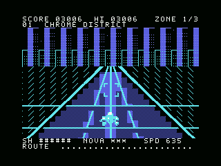
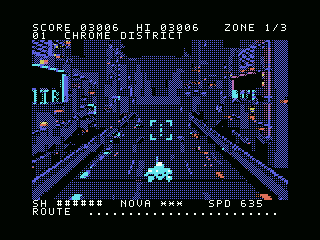

# ASTRAとMSXゲームを作る：NEON REVENANT開発ノート

[English: start on the strongest target, then adapt downward](DEVELOPMENT_APPROACH_EN.md)

夜の街を走り抜け、迫る敵を撃つ。このゲーム動画の中で動いているのは、512 KiBのMSX用ROMです。CodexのASTRAと対話しながら、企画、素材生成、C・Z80の実装、エミュレーターでの検証を繰り返し、V9990版とturbo R単体版を作りました。

人間が「この疾走感が欲しい」「背景が止まって見える」「動きはいいので絵を磨きたい」と方向を決め、ASTRAが実装と検証を進める。この記事では、その往復を別のゲーム作りにも使える形に整理します。**以下のプロンプトは実際の依頼と作業を基に再構成した例で、会話の逐語録ではありません。**


## 1. 最初に「何で動くゲームか」を固定する

最初の依頼は「MSX turbo R＋V9990で、ナイトストライカーに着想を得た爽快なシューティングを、512 KBくらいで」というものでした。ここで機種、拡張機器、ROM容量を指定したことが、その後の設計を支えました。画面の雰囲気に加えて、最終的に受け取りたい実行物まで書くと作業が具体的になります。

```text
MSX turbo R＋V9990向けに、夜のサイバー都市を疾走する
疑似3Dシューティングを作ってください。
成果物はMSX上で直接起動する512 KiBのASCII8 MegaROM。
3区域・3ボス、キーボードとジョイスティック、MSX-MUSIC＋PSG。
独自の絵と音楽を使い、まず起動・移動・射撃できるROMまで進めてください。
ソース、素材生成ツール、ビルド手順、確認結果も残してください。
```

ASCII8は、ROMの一部を8 KiB単位で切り替えてCPUから読む方式です。容量だけ指定しても、起動処理やバンク切り替えが合わなければゲームにはなりません。今回は[起動コード](../src/boot.asm)、[ハードウェア処理](../src/hardware.c)、[ゲーム本体](../src/game.c)を分け、Pythonの[ビルドツール](../tools/build.py)でROMを組み立てています。

OpenAIの[ASTRA向け公式ガイド](https://developers.openai.com/api/docs/guides/latest-model#prompting-best-practices)も、作業の継続方針、指示の優先関係、並列作業の使い方、必要な検証範囲を明確にすることを案内しています。この事例では「動くROMを成果物にする」「修正範囲を絞る」「実行して確認する」を繰り返し明示しました。

## 2. 起動の問題と絵の問題を切り分ける

最初から完成画面だけを求めると、真っ黒な画面になったときに調べる範囲が広がります。起動アドレス、RAMへの配置、ASCII8のマッパー、カートリッジのスロット、VDP初期化、表示している映像出力を順に確認しました。コンパイル成功だけでは起動確認になりません。

V9990版はopenMSXの`Panasonic_FS-A1ST`で、Cart 1にGFX9000、Cart 2にゲームROMをASCII8として設定します。F10のコンソールで`set videosource GFX9000`を実行し、V9990側を表示します。turbo R単体版はCart 1にROM、Cart 2は空、V9990拡張なし、映像は`set videosource MSX`です。**見る出力が違う**だけでも、起動していないように見えます。

この段階で動いたROMは保存します。その後の画像変更や高速化で失敗したら、同じ機種設定で旧ROMと比較できるようにするためです。今回もV9990版を保持したまま、単体版を`turbor/`へ分離しました。

## 3. 「背景が固定されている」を設計の変更につなげる

初期の画面には、背景や地面が固定されて見え、速度感が弱いという問題がありました。光る線を増やすだけでは、街の中を進んでいる感覚は十分に出ません。そこで、建物の面、窓、道路の模様そのものが、遠近法に従って手前へ移動・拡大する背景へ作り直しました。

```text
背景と地面に固定感があります。建物の面や路面模様そのものが
手前へ移動・拡大し、街の中を進んでいるようにしてください。
現在の操作と戦闘は維持。まず背景生成だけを別ファイルで作り、
実際の解像度のGIFを見せてください。
ループの継ぎ目と、ROM容量・転送時間も確認してください。
```

PC上でPython、Pillow、NumPyを使い、3D空間に置いた建物や道路を画面へ投影します。カメラを前進させて16枚を生成し、16色へ変換します。一定距離で街の構造を繰り返すため、最後から最初へ戻っても前進が続きます。数式上の一周一致と、GIFにしたときの見え方の両方を確認しました。[背景生成コード](../tools/generate_world.py)から追えます。

V9990版の背景は1枚256×180ピクセル、4bppなので、`256×180÷2＝23,040`バイト。16枚で1区域368,640バイトになります。3区域分をそのまま入れるとROM上限を超えるため、[LZSS圧縮](../tools/world_codec.py)で格納し、区域に入ると[展開処理](../src/world_load.c)が現在の区域だけをVRAMへ送ります。共通の自機・敵・文字などのアトラスは81,920バイト。コードも含め、最終ROMは524,288バイトです。[配置と容量](../outputs/build-manifest.json)をビルドごとに記録しています。

プレイ中はCとZ80の処理が背景フレームを選び、V9990の画像コピー機能で自機や敵を重ねます。PCでの重い画像生成は開発時に済ませてあります。**ゲーム実行中にPCの3D描画処理やAIクラウドへの接続は使いません。** ROM内で完結するMSXネイティブのゲームです。

## 4. 動きが良くなったら、絵を別の問題として磨く

次の反応は、動きは素晴らしいので、背景・敵・自機の見た目も「もしMSX3があったら」という方向へ、というものでした。そこでゲームの進行と描画方式を維持し、金属の面、装甲の継ぎ目、冷たい自機の排気、暖色の敵の発光へと素材を作り直しました。

```text
今の前進感と操作は気に入っています。今回は素材だけを改良してください。
「もしMSX3が存在したら」を方向に、金属の厚みと面の陰影を出す。
自機は大きな双発スラスター、敵は暖色の光で見分けやすく。
素材の名前・寸法・配置座標、ゲーム進行と音源コードは維持。
36×24の自機は等倍と拡大の両方で確認してください。
```

画像生成で作った[コンセプト画像](../outputs/msx3-concept.png)は、材質とシルエットを相談するための参考です。実際のROM素材は[生成コード](../tools/generate_assets.py)で別途作成しました。高解像度の参考画像がきれいでも、36×24ピクセルの自機でエンジンと胴体が判別できるとは限りません。等倍の自機、戦闘中の画面、文字が背景に埋もれないタイトルを順に見直しました。

素材差し替えでは、152件の配置情報と、ゲーム進行・戦闘・操作・音源のコードが維持されていることを[比較記録](../outputs/visual-scope-review-v1.2.json)に残しています。人間が見た目を評価し、AIが変更範囲を守れているか数値でも確かめる、という組み合わせです。

## 5. V9990を外すと、描き方から考え直す

turbo R本体だけで動く版では、内蔵V9958のSCREEN 4を使いました。256×192、512色から選ぶ16色で、背景は横8×縦1ピクセルにつき最大2色です。V9990の画像を縮めるだけでは収まりません。色分けを整理し、8枚の背景を各16 KiBのVDPテーブルへ変換して、128 KiBのVRAMに常駐させました。

自機と敵もハードウェアスプライトへ変換しました。16×16のパターンをMAG2で32×32に表示し、大きな機体は部品を組み合わせます。全画面32枚、同じ走査線は8枚までなので、ボスと弾が重なると部分欠落やちらつきが発生します。自機・ボスには2つの色面を使い、一般の敵は暗部を抜いて翼や砲口を読める形に調整しました。

転送ではスプライト用テーブルを2組用意し、非表示側のパターンを更新して切り替えます。データ組み立てのコピーをZ80の`LDIR`へ置き換えるなど、測って負荷の大きい部分を詰めました。[単体版ゲーム本体](../turbor/src/game.c)と[VDP処理](../turbor/src/hardware.c)に実装があります。

結果は通常の操作・スプライトが約30 Hz、背景が約15 Hz。意図的にボス・弾・敵を密集させた32枚の試験では約20 Hzです。約30という数字だけを紹介せず、落ちる条件と表示制約も[スプライト検証結果](../outputs/turbor/sprite-verification.json)に残しました。


## 6. AIに「確認した」と言わせる前に、証拠を決める

```text
できたROMをopenMSXで実行して検証してください。
起動、4方向移動、連射、ボム、ポーズ、被弾、再挑戦、
3区域のボスと最終クリアを確認し、実行画面と結果を保存。
背景データはVRAMから読み戻して生成データと照合。
速度はエミュレーター内のMSX時刻で測定してください。
RAMに試験状態を設定した場合は明記し、実機確認とは区別してください。
```

ブレークポイントで描画やゲーム更新の区切りを捕まえ、MSX側で何秒経ったかを測ります。ホストPCで数秒待っただけの測定は、エミュレーターの速度設定などに左右されます。V9990版では各区域64フレームを計測して29.96更新/秒、展開した背景368,640バイトと共通素材81,920バイトをVRAM読み戻しで照合しました。[背景・速度の検証](../outputs/world-verification-v1.2.json)と[検証ツール](../tools/verify_world.py)を公開しています。

後半のボスや被弾はRAMへ開始状態を設定して再現しました。その後の衝突判定や遷移はROMのコードで実行していますが、通常操作だけの全編通しプレイとは区別しています。また、撮影GIFと元フレームを照合し、コンセプト画像がゲーム画面として混ざらないようにしました。**MSX実機と実カートリッジは未検証です。**

## 7. 明日試すなら

1. **環境をそろえる。** Python、Pillow、NumPy、SDCC、Pasmo、openMSXと自分で用意したシステムROMを準備します。[V9990版手順](../outputs/README-ja.md)または[単体版手順](../turbor/README.md)に沿ってツールの場所を指定します。
2. **再生成とビルドを一度通す。** 各版のソースルートで`python tools/build.py`を実行します。生成ツールと容量検査がそろった構成は、AIへ渡す具体例にもなります。資料・コードの利用条件は[著作権の説明](../COPYRIGHT.md)も確認してください。
3. **最小の遊びを先に確かめる。** 新作なら背景1枚、自機1機、射撃1種類から始め、ROMの起動と操作を確認した時点で保存します。
4. **一度に一つの評価軸を変える。** 速度感、絵、操作、音を分け、何を維持するかも書きます。違和感は撮影画像や動画の場面を添えて伝えます。
5. **同じ条件で比較する。** 新旧ROM、機種設定、測定方法、検証結果をそろえ、変えた箇所と影響を確認して次へ進みます。

今回は素材、ハードウェア調査、検証を範囲の決まったサブエージェントへ分ける並列作業も使いました。「素材の寸法は固定」「このファイルだけ」と境界を決めると統合しやすくなります。ただし並列化は必須ではありません。人間が遊びと見た目を判断し、ASTRAに実装・計測・修正を具体的に依頼する流れは、一つのタスクでも始められます。

最初に目指すものを言葉にし、動く小さなROMを作り、映像を見て次の要求を返す。その繰り返しで、512 KiBの中へ何を残すかを決めていきました。試してみたい方は、まず[各版の実行ガイド](../README.md)から、映像とROMを確かめてみてください。

## 8. MSX2、そして初代MSXでも試す

さらにMSX2版と初代MSX版を独立したフォルダーへ分けました。機種の世代が下がっても、すべての画像を一律に粗くする必要はありません。MSX2のV9938には、turbo R単体版で使ったSCREEN 4とスプライトモード2があるため、まず同じ絵を保ち、Z80が毎フレーム行っている仕事を調べます。

MSX2版では、同じ機体の絵柄を何度もVRAMへ送る処理を減らしました。表示用の2組のスプライト領域に絵柄を保存し、必要なものがないときだけ転送します。どの絵柄が残っているかもCPU側で管理し、区域ロードでVRAMの内容が入れ替わるときはその記録を無効にします。高速化は転送を省くだけではなく、古い画像を誤って再使用しないところまで含めて確認します。

入力・ゲーム進行・音楽は30 Hzを基準にし、画面の描き直しとは分けました。割り込みを使う変更では、VDPへの2バイトの指示が途中で割り込まれないこと、描画の切り替えが適切な時間に行われることも確認しています。[MSX2版の実装と測定結果](../msx2/README.md)を参照してください。

初代MSXはVRAMが16 KiBで、128 KiB分の背景を常駐させる方法は使えません。そこで、全8位相に必要な背景の部品をSCREEN 2のパターンとして登録し、毎回は640バイトの配置表を送る方式へ変えました。道路の帯や壁面の灯りを動かし、固定色の面と輪郭でサイバー都市を描いています。機体も常駐する1色のスプライトへ縮約し、同時出現枠を調整しました。



音楽は両版とも標準PSGへ編曲しました。3音のうち2音でベースとメロディーを維持し、残り1音をアルペジオと効果音で共有します。「元のFM音源がなくても曲の特徴を残す」という制約を、実装方針として具体的に伝えた例です。

最後に、静止した過密配置の描画速度と、敵が動いて衝突判定も行う通常プレイの速度を分けて測っています。初代版は処理落ちするとゲーム進行と音楽も遅くなる構成なので、測定した区間の数字を全場面の保証として扱いません。[初代MSX版の測定・制限](../msx1/README.md)には、実行GIFとVRAMの照合、ポーズの文字表示まで含む検証を残しています。どちらも実機・実カートリッジは未検証です。

### 初代MSXでも、512KBを「次の景色」に使う

MSX1版v1.1「PCG Drive」では、ROMの余裕を背景の立体感へ振り向けました。v1.0は常駐したPCGの並べ替えが中心でしたが、今回は元のV9990版の街・高架・トンネルを、カメラが前進する16位相の画像として再利用しています。建物の輪郭だけでなく、壁の面積や重なりも変わるため、景色そのものが手前へ迫ります。

難所はROM容量より、16KBのVRAMと転送時間です。SCREEN2は横8ドットの各行に2色までしか置けません。そこで原画の形を128×80へ整理して2倍表示し、暗い面には黒と青・紫の細かなディザを使用。発光する窓や看板を残しながら、似た8×8タイルを共有辞書の形へ近似します。PC上で重い画像処理を済ませ、初代MSXには描画に必要な結果だけを渡す設計です。

PCGを動的に入れ替える際、表示中のタイルを上書きすると画面が途中で崩れます。今回は「同時に使う形」「隣り合う位相で使う形」を競合としてグラフ化し、競合する形には別のPCG番号を割り当てました。最後の位相から最初へ戻る箇所も含めて計算します。上・中・下の64ライン帯ごとに使用数を抑え、現在の景色を保ったまま次の形を先読みできる余白を確保しています。

ROMには、次の位相で必要になるPCG更新を転送命令列として格納します。読み込みを2回のゲームフレームへ分け、後半で裏側のネームテーブルへ背景640タイル分を書き、準備が揃ってから表示先を切り替えます。2面化しているのは文字の配置表であり、16KBの画像を丸ごと二重に持つ方式ではありません。実行時はZ80の短い転送ループで命令列を読み、HUDの数値変換と敵の描画順計算も軽くして、転送に回す処理時間を確保しました。

512KiB ROMのうち、今回は8KiB単位で62バンク、496KiBを割り当てています。ただし各バンクには余白があり、496KiB全部が画像などの実データで埋まっているわけではありません。容量の割当量とデータ量を分けて説明することも大切です。

検証では、生成画像の見た目だけでなく、エミュレータからVRAMを読み戻して各位相を復元し、予定した画像との一致や表示中PCGの保護を確認します。速度も背景だけの試験と、敵・弾・入力が動く区間を分けて測ります。今回は背景表現への挑戦で、自機や敵のスプライト形状、PSG音楽、ゲーム進行はv1.0を維持しています。実機では未検証の試作版です。



[起動・ビルド・測定結果](../msx1/README.md)

<a id="top-down-porting"></a>

## 9. 上位機種で自由に作り、魅力を残しながら下位機種へ移す

公開後、企画と方向づけを担当したkanon-aiが、今回の経験から今後の制作方針を言葉にしました。**まず上位の対象機種で、見て遊んで気に入る作品を形にする。その完成像を手元に置き、下位機種では何を残し、何を削り、どう描き直すかに集中する。** この順序なら、移植中も「ここへ近づけたい」という目標を映像と操作で確かめられます。

最初に選んだ構成はturbo R＋V9990でした。「上位機種で自由に作る」とは、その構成で動くROMの範囲で表現を伸ばすという意味です。起動と最小の遊びを先に確認する手順は続けながら、見た目と疾走感を磨きます。最初から下位機種への移植条件をすべて背負わせず、まず制作を続けたくなる完成像を得る、というモチベーションの設計でもあります。

### 移植前に、守りたい魅力を決める

この作品では、街が手前へ迫る前進感、照準を合わせて撃つ操作、ネオンの夜景と機体の見分けやすさが判断の軸になります。色数、画面の情報量、音色、同時に出せるパーツが変わるたびに、その軸で実行映像と操作を見直します。「品質を維持する」は全版を同じ画質や性能にする約束ではなく、変化した制約の中で作品の魅力が残ったと判断できる状態を目指すことです。

上位版は保存し、移植版のソースと出力を分けます。良かった画面と動作へいつでも戻れるため、新しい描画方法を試しやすくなります。ROMの余裕、RAM、VRAM、CPUの処理時間、VDPへの転送時間は別々に確認します。512KiBのROMに画像が入っても、1フレームで表示できるとは限りません。

| 今回の段階 | 残したいものと、そのための工夫 |
| --- | --- |
| turbo R＋V9990で基準を作る | 立体的に前進する街と機体の見た目を磨き、動くROMを比較の基準として保存する。 |
| turbo R単体へ移す | SCREEN 4向けに色と形を整理し、背景8枚をVRAMへ常駐。機体はハードウェアスプライトで組み立てる。 |
| MSX2へ移す | turbo R単体版の背景・機体の画素データを保ち、パターンキャッシュで転送を削減。ゲーム・音楽の更新を描画から分ける。 |
| 初代MSXへ移し、さらに磨く | 常駐PCGの並べ替えから始め、v1.1ではPCGの先読みと配置表の切り替えへ発展。元の背景の面・窓・反射を残す方法を試す。 |

今回の初代MSX版が、最初の線を中心とした表現からさらに進められたのも、上位版の街の完成像と元の素材があったためです。「512KBもあるのでPCGをもっと使えないか」という人間側の問いに対し、ASTRAが素材変換、転送設計、計測、高速化を進めました。人間が魅力を判断し、AIが具体案を実装して証拠を返す、この往復が今回の作り方です。

### 試す順序と、対応機種を区切る判断

移植では、まず計測して負荷の理由を絞り、重い処理の事前計算、同じデータの再利用、描画方式の変更を試します。必要に応じて色やパーツ数、装飾、背景の更新頻度を調整し、その都度、守りたい魅力と引き換えになるものを評価します。これは今後にも使える試行順の例で、すべての変更を今回実装したという意味ではありません。

```text
上位機種版のROMと実行動画を基準に、次の機種への移植を試してください。
優先するのは前進感、照準と敵の見やすさ、操作の反応です。
上位版を保存し、移植版は独立したフォルダーに作成してください。
まずCPU・VRAM・転送時間のどこが制約になるか測定し、
残すもの、削る候補、別の方式で置き換える候補を具体化してください。
一案ずつ動くROMで比較し、採用した工夫と残った欠点を記録してください。
核となる魅力が守れない場合は、その理由と試した案を示してください。
```

表現方法を変えても前進感が弱い、必要な敵や弾を見分けにくい、操作や音の遅れが遊びを損なう、と判断したら、その移植案を見直します。使えるアイデアを試しても必要な品質へ届かなければ、対応範囲をそこで区切り、成功した機種の版を作品として公開できます。最下位機種への到達そのものを完成条件にする必要はありません。

今回は初代MSXのRAM64KiB構成まで、依頼者が魅力を感じる形へ進められました。ただし、スプライトの欠け・ちらつき、版ごとの描画速度差、初代版の処理落ちによるゲームと音楽の遅れは残っています。到達できたことと、制限がなくなったことは分けて記録します。実機・実カートリッジでの確認も今後の課題です。

### 次の作品へ持ち帰る記録

新しい工夫が増えたら、**「守りたかった魅力」「制約と採用した方法」「同じ条件での比較結果」「残る欠点と採否」**を一組にして、この開発ノートへ追記していきます。失敗した案も、対象機種、試したROM、映像や計測があれば次の判断に使えます。

上位機種で作る楽しさと、下位機種の制約から別の表現を発見する楽しさを、一つの作品で続けられる方法です。この事例を別のゲームへ応用するときも、何を魅力の核とするか、どこまで対応するかは、その作品を作る人が決めます。
