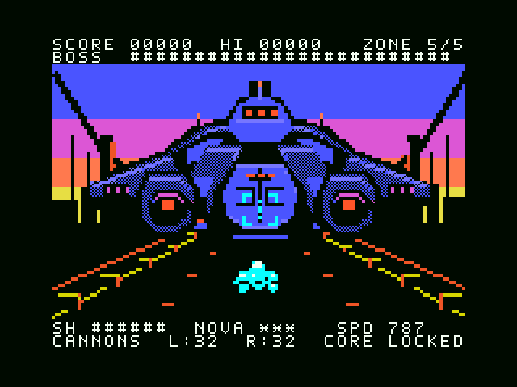

# MSX1 v1.3 — Dawn Leviathan

**夜明けへの脱出路を、巨大戦艦が塞ぐ。**

初代MSX版の最終区域 **DAWN EXODUS** に、約216×98ドットの巨大PCGボスを実装しました。船体の左右・上下移動、独立した砲身の反動、露出コアの明滅を組み合わせています。左右の砲台を破壊すると中央装甲が開き、24ゲーム更新の開放期間を経てコアを攻撃できるようになります。撃破後は船体が消え、元の夜明けの道路が戻ります。

最初の4区域と最終区域の通常道中はv1.2を維持しています。前版の[ASTRAからの有難うエディション](ASTRA_THANK_YOU_EDITION.md)を残し、初代MSXで大きなキャラクターを動かす追加チャレンジとして別バージョンにしました。

**初代MSX版の開発はいったんv1.3で完了とします。** バグ報告への対応可否・時期は未定で、修正やサポートは保証しません。試作版としての配布条件・無保証・新しいv1.3の実機未検証という条件は継続します。

[v1.3リリース / Release](https://github.com/kanon-ai/NEON_REVENANT/releases/tag/prototype-msx1-dawn-leviathan-2026-09-07) · [ROM](../outputs/msx1/v1.3/NEON_REVENANT-MSX1-v1.3.rom) · [日英の操作・ビルドガイド](../msx1/GIANT_BOSS-v1.3.md)

上は実際のROM実行から撮影した連続32描画フレームです。巨大戦艦を含むゲーム更新はNTSC約29.96回/秒、PAL約25.07回/秒。背景PCGの位相はゲーム更新2回で1回進みます。砲台が動く通常戦闘で、敵弾と被弾処理を有効にし、発射入力をせずに計測しました。[NTSC記録](../outputs/msx1/v1.3/ntsc/giant-verification.json)・[PAL記録](../outputs/msx1/v1.3/pal/giant-verification.json)

こちらは**4種類の損傷状態をRAMに設定して撮影した比較モンタージュ**です。1試行で順に砲台を壊した全戦闘の録画ではありません。通常状態、左砲台破壊、右砲台破壊、両砲台破壊＋中央開口を見比べるため、各サンプルを160msで表示しています。

## 動作条件

| 項目 | v1.3の条件 |
|---|---|
| 本体・CPU | 初代MSX、標準Z80 3.58MHz |
| ROM | 512KiB / 524,288バイト、ASCII8 |
| RAM | 32KiB以上。8000h–FFFFhを同一RAMスロットに配置 |
| VDP・VRAM | TMS9918A/TMS9929A系、16KiB、SCREEN 2 |
| 音源 | 本体標準PSG |
| ROM空き | 88KiB / 90,112バイト |

[ビルド記録](../outputs/msx1/v1.3/build-manifest.json)では424KiBを割り当て、512KiB以内に収めています。RAM16KiB機は対象外です。V9990、追加PCGカートリッジ、FM音源、MSX-DOSは不要です。

矢印またはジョイスティック1で移動し、Space／トリガー1で開始・発射、X／トリガー2でNOVA、Escで一時停止します。巨大戦艦は5番目の区域の最後に出現します。

**開発途中・無保証の試作版です。開発側の検証はopenMSXで行いました。新しいv1.3の実機MSX・実フラッシュカートリッジ動作は未確認です。** 旧版について寄せられたコミュニティの実機報告は、新版やすべての機種・カートリッジの互換性を保証しません。[免責事項](../DISCLAIMER.md)・[著作権](../COPYRIGHT.md)・[第三者ライセンス](../THIRD_PARTY_NOTICES.md)

## 巨大PCGボスを成立させる工夫

**大きな船体は背景PCG、小さな自機・弾・弱点表示はスプライト**に分担しました。船体全体をスプライトで組まないことで、初代MSXの走査線4枚制限を大きさの制約にしない構成です。ただしPCGは背景と描画面を共有し、横8×縦1ドットの色制約も受けます。ボス専用の画面配置で、下側の暗い道路と自機の空間を確保しました。

船体を8ドット単位で動かすと、既存のPCGを**ネームテーブル上で移し替えて再利用**できます。左右への移動と8ドットの浮上に、砲身だけの2ドット反動を加え、大きな移動と細かな部品の動きを分けました。黒と青のディザで装甲を暗くし、暖色の夜明けから船体を分離しています。シアンは自機と自弾のために残しました。[元のピクセルアート生成コード](../msx1/tools/pcg_boss_art.py)

PCG更新はA/Bの2回に分け、現在見えている模様を壊さずに準備し、別のネームテーブルへ切り替えます。破壊された砲台や開いたコアの模様はVRAMに常駐させ、4つの状態でネームテーブルの参照先を変更します。損傷状態を変えるたびに巨大な画像全体を転送する必要はありません。最大の転送量は1回640バイト、船体の16位相と損傷用素材の合計は62,144バイトです。[コンパイラー](../msx1/tools/compile_boss.py)・[配置と全状態の検証](../outputs/msx1/v1.3/giant-codec-verification.json)

一般背景のPCG制限は変更せず、ボス専用の割り当てで、各64走査線帯の使用数を85／236／84に収めています。描画中に使う模様と次の位相が同時に存在できること、状態を途中で切り替えても表示を壊さないことを検証しています。

## 検証

対象ROMのSHA-256は `836ee25b969928c0617330fe454a52e8b8b6c4d9fa5c9d3986eef0a11d42894b` です。

| 試験 | NTSC | PAL | 内容 |
|---|---|---|---|
| 通常動作 | [61項目](../outputs/msx1/v1.3/ntsc/verification.json) | [61項目](../outputs/msx1/v1.3/pal/verification.json) | 起動・操作・全区域遷移・クリア・再挑戦・RAM保護 |
| 巨大ボス | [69項目](../outputs/msx1/v1.3/ntsc/giant-verification.json) | [69項目](../outputs/msx1/v1.3/pal/giant-verification.json) | 4状態×16位相、砲台破壊、コア開放、停止・撃破・再挑戦 |
| 背景・描画 | [61項目](../outputs/msx1/v1.3/ntsc/world-verification.json) | [61項目](../outputs/msx1/v1.3/pal/world-verification.json) | 5区域のVRAM読み戻し、動き、スプライト、HUD、PSG |
| 転送 | [9項目](../outputs/msx1/v1.3/ntsc/transfer-verification.json) | [9項目](../outputs/msx1/v1.3/pal/transfer-verification.json) | 長さ境界・レジスター保持・意図的な不正転送の検出 |
| 合計 | **200項目成功** | **200項目成功** | **合計400項目** |

各映像方式で通常背景480回と巨大ボス128回のVRAM読み戻しを照合しました。巨大ボスは転送のA/B両段階を確認し、途中の損傷状態変更や、撃破演出中に停止・再開しても船体が復活しないことを含めて検証しています。通常動作でVRAMタイミング違反は0件。意図的に間隔を守らない転送も試し、検出機構が働くことを確認しました。

ホストCの比較では、巨大ボスを除く既存処理の**73,159時点×163項目**がv1.2と一致しました。最初の4区域はボスと区域遷移まで、最終区域は変更前の通常道中を対象にしています。新しい巨大ボスのホスト試験は**17,888検査**、PCGの全状態遷移検証は**1,424画面比較**に合格しました。[既存処理との比較](../outputs/msx1/v1.3/giant-preservation-verification.json)・[PCG検証](../outputs/msx1/v1.3/giant-codec-verification.json)

素材を再生成した独立ディレクトリと、実際の配布ZIPを展開したソースから、それぞれ同じROMを再ビルドしました。[再現性](../outputs/msx1/v1.3/reproducibility.json)・[ZIP展開後の照合](../outputs/msx1/v1.3/archive-extraction-verification.json)

試験にはRAMで区域時計・HP・位置・損傷状態を設定した場面が含まれます。ROMが入力、当たり判定、転送、ページ切り替えを実行しますが、通常入力だけの全編プレイではありません。ホストCはGCCの整数昇格規則を使い、Z80やVDPの実時間を証明しません。検証方法と測定結果を分けて記録しています。

再検証用に旧Cソース・移植可能なハッシュ表・旧ROMを同梱しています。ネイティブ試験の実行条件、外部コンパイラー、再ビルドと比較の手順は[日英ガイド](../msx1/GIANT_BOSS-v1.3.md)に記載しています。BIOSやエミュレーターの実行ファイルは配布物に含みません。

## English

**Dawn Leviathan** adds a roughly 216×98-pixel PCG battleship to the end of the original MSX edition's DAWN EXODUS route. The hull shifts sideways and upward in 8-pixel steps, cannon barrels independently recoil by 2 pixels, and the exposed reactor pulses. Destroy both cannon pods; after 24 game updates of armour opening, attack the core. Defeating it restores the original dawn road. The first four zones and ordinary play before the final boss retain v1.2 behavior.

**Current feature development of the MSX1 edition is complete with v1.3.** Whether or when bug reports will be addressed is undecided; fixes and support are not guaranteed. Prototype distribution terms, no warranty, and the lack of physical-hardware validation for the new v1.3 remain unchanged.

The continuous GIF above contains 32 consecutive native ROM frames. The damage-state GIF is explicitly a **montage of four RAM-seeded states**, presented at 160 ms per sample; it is not a complete fight recording.

Requirements remain **512 KiB ASCII8 ROM, 32 KiB RAM covering 8000h–FFFFh in one RAM slot, 16 KiB VRAM on a TMS9918A/TMS9929A-family VDP, and the standard PSG**. The ROM allocates 424 KiB and leaves 88 KiB unused. No V9990, additional PCG cartridge, FM expansion or MSX-DOS is required. See the [play/build guide](../msx1/GIANT_BOSS-v1.3.md) and [release](https://github.com/kanon-ai/NEON_REVENANT/releases/tag/prototype-msx1-dawn-leviathan-2026-09-07).

The large hull uses background PCGs; sprites handle the player, projectiles and weak-point indicators. Moving the hull by one tile reuses existing patterns through name-table placement. Small permanent damage tiles allow four states without uploading a complete new image. Two-part transfers prepare the next phase without changing visible patterns, then flip the name page. Blue/black dithering keeps the armour dark against the warm sky and reserves cyan for the player. The boss assets total 62,144 bytes; the largest transfer part is 640 bytes. The three screen bands use 85/236/84 PCG slots, with physical capacity and every state transition checked.

**400 native checks passed in openMSX: 200 on each 32 KiB NTSC/PAL configuration.** Each standard includes 61 general checks, 69 giant-boss checks, 61 world/rendering checks and 9 transfer checks. We compared 480 ordinary-world and 128 giant-boss VRAM readbacks per standard. The moving giant fight measured **29.96 NTSC / 25.07 PAL game updates per second**, with enemy shots and player damage enabled but no firing input. PCG animation advances once per two game updates. PAL gameplay and music run more slowly because they are frame-bound. The linked reports in the table give the precise conditions and results.

Host C regression checks matched **73,159 snapshots × 163 fields** against v1.2 outside the new final-boss encounter, and performed **17,888 assertions** on the new mechanics. The offline PCG verifier compared **1,424 rendered states/transitions**. Independent asset regeneration and a rebuild from the extracted distribution ZIP produced the same ROM. [Preservation](../outputs/msx1/v1.3/giant-preservation-verification.json), [PCG proof](../outputs/msx1/v1.3/giant-codec-verification.json), [rebuild evidence](../outputs/msx1/v1.3/reproducibility.json), [ZIP extraction evidence](../outputs/msx1/v1.3/archive-extraction-verification.json).

Tests deliberately seed selected clocks, health, positions and damage states. ROM code executes input, collision, display transfers and page flips; this is not a full input-only playthrough. Host C checks use the GCC ABI and do not establish native timing. The portable v1.2 baseline is included for repeatable comparisons; BIOS, emulator and compiler executables are not distributed.

**This is a work-in-progress prototype, provided without warranty. Developer testing uses openMSX. Earlier editions have received community hardware reports, but this new v1.3 has not been validated on physical MSX hardware or flash cartridges.** Read the [disclaimer](../DISCLAIMER.md), [copyright terms](../COPYRIGHT.md) and [third-party notices](../THIRD_PARTY_NOTICES.md).
