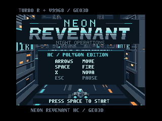

# NEON REVENANT HC / Geo3D v0.1.0 — テスト版 / TEST RELEASE

**開発・評価用のテスト版です。完成版ではありません。** MSX turbo R（R800）＋V9968＋Geo3D向けに、NEON REVENANTの全5区域とボス戦をポリゴンで描く版を追加しました。既存の各機種版・通常版HCも引き続き利用できます。

**現段階では、Geo3D開発元が公開している公式のGeo3D対応openMSXのみで検証しています。後日、BlueMSX Geo3D版での検証を追加する予定です。** BlueMSX Geo3D版での検証はまだ実施していません。実機・FPGAでの動作と性能は未検証です。

ここで「公式のエミュレータ」は、Geo3D開発者Alex Moncks氏の [Geo3D対応openMSX](https://github.com/alexmoncks/openMSX) を指します。一般配布版openMSX全般で動作確認したという意味ではありません。

[ROM・ソース・動画のダウンロード](https://github.com/kanon-ai/NEON_REVENANT/releases/tag/geo3d-test-v0.1.0)



## 内容

湾岸、市街地、工業通路、トンネル、夜明けの橋の5区域を進むシューティングです。HC版の敵パターンと戦闘を土台に、曲がり・高低差・バンクを持つ道路、3種類の敵機、各区域のボスと巨大最終ボスを立体化しました。V9990版のタイトル美術と音楽を引き継ぎ、MSX-MUSICのBGMとPSG効果音、命中時のパーティクル、NOVAを搭載しています。

同じゲームテーマを異なるMSX構成で表現してきたプロジェクトの締めくくりとして、今回はGeo3Dによる奥行きと動きに挑戦しています。


[全5面とボスの音声付きダイジェスト](https://github.com/kanon-ai/NEON_REVENANT/releases/download/geo3d-test-v0.1.0/NEON_REVENANT-HC-Geo3D-v0.1.0-digest.mp4)。専用エミュレータの実行録画で、倍速化はしていません。撮影時のみ各面への移動とシールド維持を行っています。

## ROMと操作

| 項目 | 内容 |
|---|---|
| 対象構成 | MSX turbo R（R800）＋V9968＋Geo3D |
| ROM | 各4 MiB、ASCII16 |
| テクスチャ版 | `outputs/NEON_REVENANT-HC-Geo3D-textured-v0.1.0.rom` |
| 無地比較版 | `outputs/NEON_REVENANT-HC-Geo3D-solid-v0.1.0.rom` |
| 音源 | MSX-MUSIC BGM＋PSG効果音 |
| 操作 | 矢印：移動、SPACE：開始・射撃・再挑戦、X：NOVA、ESC：一時停止／再開 |

## 起動

検証に使用した開発元openMSXはコミット `de29fb854885a38251c03e24596ad4ff95770ef2`、機種は `Panasonic_FS-A1ST_V9968`、拡張は `geo3d` です。同じ版の実行ファイルとshareデータ、お手持ちのBIOSを用意してください。エミュレータ、BIOS、FPGAビットストリームは同梱しません。

```text
openmsx.exe -machine Panasonic_FS-A1ST_V9968 -ext geo3d -cart outputs/NEON_REVENANT-HC-Geo3D-textured-v0.1.0.rom -romtype ASCII16 -script interactive.tcl
```

Windowsでは `OPENMSX_EXE` に実行ファイルのパスを設定して `run-textured.cmd` または `run-solid.cmd` を使用できます。必要に応じて `OPENMSX_SYSTEM_DATA` に対応するshareフォルダーを指定してください。スクリプトは音声出力と通常速度を有効にし、設定の終了時保存を無効にします。

## 検証範囲とテスト版の制限

- 両版で音楽・効果音、命中、ポーズ復帰を確認。テクスチャ版で全5区域と各ボスを録画し、短縮条件による区域遷移・最終クリアとゲームオーバー後の再開を確認しました。
- 区域時間・ボスHP・撮影位置を設定した検証を含みます。手操作での全編クリアや全状況の保証ではありません。
- 走行経路は共通の周回データです。ESCでは戦闘が止まりますが走行演出は続きます。クリア画面は簡易表示です。
- 場面により描画速度が変わります。近接面・斜め面のテクスチャの見え方や難易度には調整の余地があります。
- **BlueMSX Geo3D版：後日検証追加予定。実機・FPGA：未検証。**

試作ソフトとして無保証で提供します。不具合修正・サポートは保証しません。[免責事項](DISCLAIMER.md)・[著作権とライセンス](COPYRIGHT.md)・[第三者への謝辞](THIRD_PARTY_NOTICES.md)

## ビルド

Python 3、`requirements.txt` のライブラリ、SDCC（Z80）を用意します。検証はSDCC 4.6.0 #16555を使用しました。`SDCC_BIN`にbinフォルダーを指定するか、SDCCをPATHに配置してください。

```powershell
python -m pip install -r requirements.txt
$env:SDCC_BIN = 'C:\path\to\sdcc\bin'
python build.py
# out/NEON_REVENANT_GEO3D.rom
$env:NEON_TEXTURE = '0'
python build.py
# 無地版 / solid variant
```

## English

**Geo3D v0.1.0 is a TEST RELEASE, not a finished product.** This MSX turbo R + V9968 + Geo3D edition brings the five sectors and boss encounters into polygon graphics, with HC combat, textured and solid variants, MSX-MUSIC BGM, PSG effects and hit particles. Each ROM is 4 MiB ASCII16.

**Currently tested only with the official emulator provided by the Geo3D developer: Alex Moncks' Geo3D-enabled openMSX, commit `de29fb854885a38251c03e24596ad4ff95770ef2`. Verification with BlueMSX Geo3D is planned for a later update and has not yet been performed. Physical hardware/FPGA behavior and performance are unverified.** This does not claim testing with general openMSX distributions.

Use machine `Panasonic_FS-A1ST_V9968` and extension `geo3d`. Arrows move; SPACE starts/fires/restarts; X activates NOVA; ESC pauses/resumes combat. Emulator, BIOS and FPGA files are not bundled. Tests include scripted entries, shortened stage timers and boss HP, rather than a complete manual playthrough. The video uses actual emulator audio, normal playback speed and controlled stage entries/shield. Provided AS IS under the existing project terms; fixes and support are not guaranteed.
