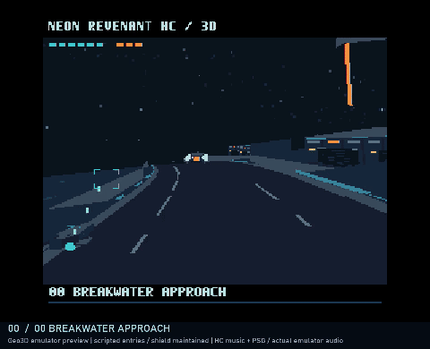

# NEON REVENANT HC / Geo3D v0.2.0 — 256色テスト版 / TEST RELEASE

**開発・評価用のテスト版です。完成版ではありません。** MSX turbo R＋V9968＋Geo3D向け、全5区域のポリゴンシューティングを256色・テクスチャで更新しました。ROMは4 MiB ASCII16です。

**Geo3D開発元Alex Moncks氏の公式Geo3D対応openMSXに加え、2026年10月5日にblueMSX PlusのGeo3D対応実験版でも追加検証しました。今回のROMの実機・FPGA動作は未検証です。** 公式とはAlex Moncks氏の[Geo3D対応openMSX](https://github.com/alexmoncks/openMSX)を指します。

[ROM・ソース・動画](https://github.com/kanon-ai/NEON_REVENANT/releases/tag/geo3d-test-v0.2.0) · [旧16色版v0.1.0](https://github.com/kanon-ai/NEON_REVENANT/releases/tag/geo3d-test-v0.1.0)

## 更新内容

- 256色パレット、星空・市街地・工業通路・夜明けの空を更新。
- 01面は双胴、02面は厚い一体型船体、03面はゲート型、最終ボスは巨大戦艦。00～02面は同系列の量産機をイメージしています。
- 砲口からの発射と命中パーティクル。V9990版由来のタイトル、MSX-MUSIC BGMと調整済みのPSG効果音を継承。
- 見えない床の削減、固定換気ファンのテクスチャ化、敵の描画順計算の再利用、VDP完了待ちの整理、HPバー計算のキャッシュで軽量化。フレーム間引きは行っていません。
- 他機種版と旧Geo3D版は引き続き利用できます。



[音声付き55秒ダイジェスト](https://github.com/kanon-ai/NEON_REVENANT/releases/download/geo3d-test-v0.2.0/NEON_REVENANT-HC-Geo3D-v0.2.0-digest.mp4)。実行録画で再生速度を変更していません。各面への移動・シールド維持を行った紹介用の撮影です。

## 起動と操作

`outputs/NEON_REVENANT-HC-Geo3D-256-v0.2.0.rom` を使用します。Windowsでは `OPENMSX_EXE` に実行ファイルのパスを設定して `run-textured.cmd` または `run-256.cmd` を実行してください。

```text
openmsx.exe -machine Panasonic_FS-A1ST_V9968 -ext geo3d -cart outputs/NEON_REVENANT-HC-Geo3D-256-v0.2.0.rom -romtype ASCII16 -script interactive.tcl
```

検証環境は開発元openMSXコミット `de29fb854885a38251c03e24596ad4ff95770ef2`。対応するshareデータとお手持ちのBIOSが必要です。エミュレータ・BIOS・FPGAファイルは同梱しません。必要に応じ `OPENMSX_SYSTEM_DATA` を設定してください。

矢印：移動、SPACE：開始・射撃・再挑戦、X：NOVA、ESC：戦闘のポーズ／再開。走行経路は共通の周回データで、ポーズ中も走行演出は続きます。クリア画面は簡易表示です。

[blueMSX Plusの起動設定・使用バージョン](BLUEMSX.md)

## 検証と速度

開発元openMSXでは、全5面の敵出現・ボス・描画、砲口と発射座標、操作・命中・音・ポーズ・ゲームオーバー後の再開、短縮条件での全5面から最終クリアへの遷移を確認しました。手操作での全編クリアや全状況の保証を意味しません。

blueMSX Plus `V9968-geo3d-experimental-2`（`2090cd2`、x64）では、同じ公開ROMでタイトル・全5区域の背景と敵弾・全ボス・ゲームオーバー表示、および音声出力を確認しました。シールド補充、区間タイマー短縮、ボス戦からの遷移指定を使用しています。手操作での全編クリア・全操作の再検証・ピクセル単位の一致・両エミュレータの厳密な速度比較は含みません。[検証記録](outputs/verification-v0.2.0/bluemsx.json)。ROMとゲーム内容は変更していません。

[速度比較](outputs/verification-v0.2.0/performance.json)は同じ160画面更新で比較したエミュレータ上の値です。通常区間は敵3機／9機固定、ボスは撮影用のHP・シールド制御を含みます。全編平均FPSや今回のROMの実機測定ではありません。

## ビルド

Python 3、NumPy、Pillow、Z80用SDCCが必要です（検証：SDCC 4.6.0 #16555）。`SDCC_BIN`にbinフォルダーを指定するかSDCCをPATHへ配置してください。

```powershell
python -m pip install -r requirements.txt
$env:SDCC_BIN = 'C:\path\to\sdcc\bin'
python build.py
# out/NEON_REVENANT_GEO3D.rom
```

背景素材の一部にAI画像生成を使用し、ゲーム用に減色・配置しています。ボスの装甲柄と換気ファンはコードで作成したピクセルアートです。

試作ソフトとして無保証で提供します。[免責事項](DISCLAIMER.md)・[著作権](COPYRIGHT.md)・[謝辞と第三者ライセンス](THIRD_PARTY_NOTICES.md)

## English

**v0.2.0 is a 256-color TEST RELEASE, not a finished product.** Five sectors, redesigned polygon bosses, textured scenery, MSX-MUSIC BGM and PSG effects in a 4 MiB ASCII16 ROM. Rendering optimizations preserve normal frame presentation without frame skipping. The previous 16-color v0.1.0 remains available in its release.

Tested with Alex Moncks' official Geo3D-enabled openMSX and, on October 5, 2026, the Geo3D experimental build of blueMSX Plus. Physical hardware/FPGA remains untested. Tests include scripted stage entry, controlled shields and shortened stage timers/boss HP. The video is unaccelerated emulator capture with actual audio. Performance comparisons are controlled emulator scenarios, not a full-game average or physical-hardware measurement. Emulator and BIOS files are not included. Provided AS IS under the existing project terms.

BlueMSX coverage: title, all five sectors and bosses, enemy projectiles, game-over display, and recorded audio output. Shields, stage timers and transition states were controlled for coverage. This is not a manual full-game clear, exhaustive control retest, pixel-equivalence test or cross-emulator speed benchmark. See [setup](BLUEMSX.md). The ROM is unchanged.
