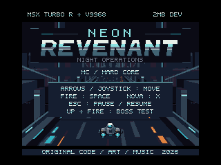
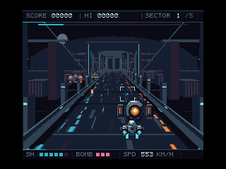

# NEON REVENANT HC — V9968 Edition

**HC = Hard Core。V9968専用の戦闘アレンジ版です。** 夜のサイバー都市を駆け抜ける5区域の疑似3Dシューティングに、敵の出現密度・接近・射撃を調整した、歯応えのある戦闘を組み合わせました。既存のV9990・Turbo R・MSX2・MSX初代版は変更していません。

## ダウンロードと起動
- [ROM](outputs/NEON_REVENANT-HC-V9968.rom)：2 MiB、ASCII8。MSX turbo R（R800高速モード）＋外付けV9968、I/O 88h。
- [ROM・ソース一式](https://github.com/kanon-ai/NEON_REVENANT/releases/tag/hc-v9968-v1.0)
- 動作確認：buppu3氏の[V9968対応openMSX](https://buppu3.github.io/)。2026-09-21公開の194a769系では **V9968_OLD** のレジスタ互換設定を使用します。標準openMSXや、新定義のV9968設定のままの起動には対応していません。

ZIPを展開し `run-v9968-hc.cmd` を起動してください。既定の実行ファイルは `C:\Program Files\openMSX\openmsx.exe`、変更時は `OPENMSX_EXE` を指定します。通常のPanasonic_FS-A1ST機種と必要なBIOSを利用者側で設定済みであることが必要です。CMDは同梱の最小拡張設定を指定し、全体の機種設定を書き換えません。映像出力はV9968へ切り替わります。

旧d884c4b系を使う場合は従来の `HRA_V9968` 拡張（version=V9968）を選び、同じROMをASCII8で読み込みます。新版用CMDをそのまま旧エミュレータに使わないでください。

**本版はエミュレータで確認した試作版です。実機・現行FPGAでの動作は未確認です。V9968本体の仕様やエミュレータの更新に応じて、今後ROMや設定の修正が必要になる可能性があります。修正の実施・時期、互換性、継続サポートは保証しません。** [免責事項](DISCLAIMER.md)・[利用条件](COPYRIGHT.md)

## 操作
矢印キー／ジョイスティック：移動、SPACE／トリガー1：開始・射撃、X／トリガー2：NOVA、ESC：一時停止・再開。タイトルで上＋射撃は最終ボスの確認用です。

## ビルドと検証
Python 3、SDCC 4.6.0 #16555（Z80）、Pasmoを別途用意します。`SDCC_BIN` にSDCCのbinフォルダ、`PASMO` にPasmo実行ファイル、必要に応じ `PYTHON_EXE` を指定して `newbuild.cmd` を実行します。コマンドラインでは `python tools/build.py`。生成済み素材を収録しており画像生成ツールは不要です。エミュレータ・BIOS・コンパイラ本体は同梱しません。

全5区域の背景VRAM、発砲・弾速、00面からボスへの移行、画面切替、起動・移動をエミュレータで確認しました。RAMに場面や体力を設定する検証を含みます。手操作での全編通しクリアや実機確認を意味しません。公開用パッケージからROMの再ビルド一致も確認しています。確認済みROMのハッシュは `SHA256SUMS.txt` を参照してください。

## English
**NEON REVENANT HC (Hard Core)** is a V9968-specific combat arrangement of the five-sector pseudo-3D shooter. Denser encounters, quicker approaches and earlier/faster enemy fire create a more demanding experience. Other editions remain unchanged.

2 MiB ASCII8 ROM, MSX turbo R in R800 mode, external V9968 at I/O 88h. Tested with buppu3's V9968-enabled openMSX, including the 194a769-era build using **V9968_OLD** compatibility mode. The bundled launcher selects that profile; it requires an installed emulator and user-provided BIOS for Panasonic_FS-A1ST. Neither is included. Standard openMSX and the new-register V9968 profile are not supported by this ROM.

Arrows/joystick: move; SPACE/trigger 1: start/fire; X/trigger 2: NOVA; ESC: pause/resume. Up+fire on the title opens the final-boss test.

Experimental, AS IS, WITHOUT WARRANTY. Physical hardware/current FPGA have not been validated. Future V9968 specification or emulator changes may require ROM/configuration updates; fixes, timing and support are not guaranteed. Tests include RAM-seeded scenarios, not a complete manual campaign playthrough. See [disclaimer](DISCLAIMER.md), [usage terms](COPYRIGHT.md), and [third-party notices](THIRD_PARTY_NOTICES.md).
